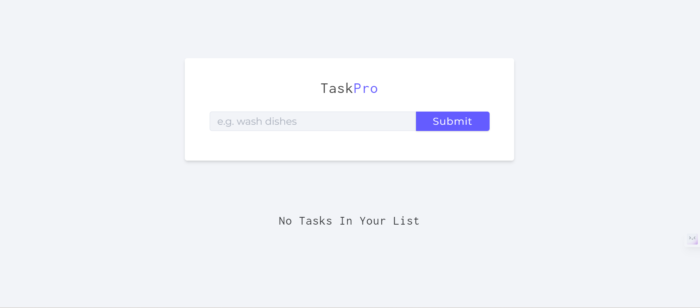
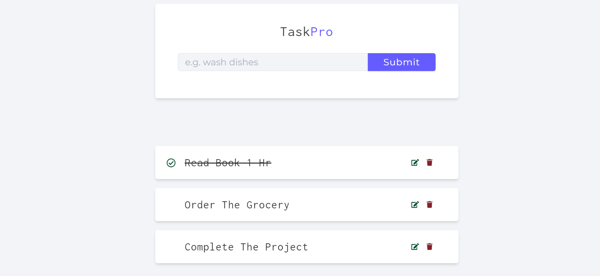
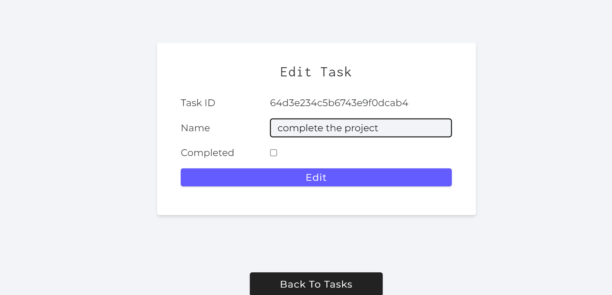

# TaskPro: Full Stack To-Do Manager
---
Welcome to TaskPro, a powerful full stack to-do manager application. With TaskPro, you can efficiently organize your tasks, edit them, and mark them as completed, all while enjoying a seamless user experience. Whether you're looking for a simple task list or a comprehensive to-do manager, TaskPro has you covered.

 

## Tech Stack
---


## Screenshots

  **Home Page**


    **Add Task**


    **Edit Task**
 


    

 
##  Deployed Link from cyclic.sh  :
     
 https://handsome-leotard-jay.cyclic.app/

## Features
---
- Add new tasks to your to-do list.
- Edit existing tasks and mark them as completed.
- Delete tasks that are no longer needed.
- All tasks are saved and available for future use.

## Installation
---
1. Clone this repository:

```bash 
git clone https://github.com/MehraDevesh2022/TaskPro.git

```

2. Install the dependencies:
---
```bash
cd TASKPRO
npm install
```

 - Add your MongoDB URI to the config/.env file. Use key name as DB_LINK  and assign your MongoDB URI to it.  

3. Start the server:
---
```bash
npm start
```

4. Navigate to `http://localhost:3000/` in your browser of choice.
---
## Contributing

Contributions are always welcome ! add your own features and make a pull request.


